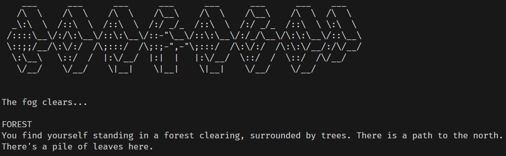

# zork-rust

> WARNING: This is a work in progress.

So, I decided to try my hand at Rust. I gave myself two weeks to build a Zork-like game engine. Although the objects are built-in, I wanted to mimic the open-ended text-based experience of the Zork universe. Having never done any Rust programming, I thought, "how hard could it be?" *Very*, as it turned out.

Let's start with the good stuff.

* Rust happily creates tiny programs that run quickly.
* Rust has good support in the VS Code editor.
* Rust supports many OOP and functional paradigms, although the switch to Trait-based modeling was a jump for me.
* Rust adds memory management concepts like **"ownership" and "borrowing"** so that it can manage your memory without a garbage collector.

It's this last point that got me into trouble.

Here's a video link for the demo, if you just want to see it working.

[Software Demo Video](https://youtu.be/0Nlt35mCq08)

## Objects vs. Traits.

First of all, Traits may remind you of Objects, but they implement only a kind a functional inheritance. The root structures can be wildly different. However, in my OOP/GOF/C++ paradigm-steeped brain, I wanted very badly to use **inheritance** to build my objects, but that isn't how Rust does things.

Instead of inheritance, you can **derive** basic behaviors from Default, Clone, or PartialEq. Or, you can implement standard traits or defined your own (somewhat like **interfaces** in C++/C#/Java).

I decided to track objects by name (this was before I fully understood references) so I defined the **GameObject** trait, which must be implemented by every object in the game: **Forest, Leaves, Key, House, Door, Garden, Kitchen, Cupboard, Knife, Bread, etc.**

## Borrowing vs. Pointers

> NOTE: None of this is going to make sense until you read [Chapter 4: Understanding Ownership](https://doc.rust-lang.org/book/ch04-00-understanding-ownership.html).

You'd think this concept would be better explained in the docs, but old paradigms die slowly. The StackOverflow questions I've read usually sound like this:

* [What are the differences between a pointer and a reference in Rust?](https://stackoverflow.com/questions/62232753/what-are-the-differences-between-a-pointer-and-a-reference-in-rust)
* [What's the relationship between Box, ref, &, and *?](https://stackoverflow.com/questions/31949579/understanding-and-relationship-between-box-ref-and)
* [Why can't I store a vale and a reference to that value in the same struct?](https://stackoverflow.com/questions/32300132/why-cant-i-store-a-value-and-a-reference-to-that-value-in-the-same-struct)

Here's what I know (which may be complete hogwash).

### *"There can only be one." -- Highlander.*

1. Idiomatic Rust is parsimonious with it's references. It's best if the `&` reference lived as briefly as possible. A borrower cannot take ownership of it and, heaven help you if you try to create a `mutable` reference alongside an `immutable` one, or try to hold or pass mutable references around beyond their lifetimes... Once you've fallen into this vortex of sorrow, it's hard to crawl out again.

1. If you aren't paying attention to how you pass values around, you can easily lose ownership of an object. Deciding whether to pass the object along or prolong ownership can sometimes take hours to sort out in a non-trivial program.

1. It can be tricky to build an object that you plan to pass back to the caller (factory methods). If you create your object by accident on the stack (easy to do for a n00b like myself), then your attempt is doomed. You must create a Box (or "smart pointer") to heap allocated memory for any hope of success. However, you might still run afoul of **lifetime** rules, and the Box could destroy your new object on the way out.

1. The choice to use an immutable `&str` (aka: `&'static str`) or a `String` can be tricky too. I normally prefer the option that uses the least amount of memory, but using `&str` will sometimes trigger the "argument requires that `'1` must outlive `'static`" error.

    > After I learned that `&String` wasn't **idiomatic Rust**, I dutifully removed them from my code. Now I am fighting the Clone Wars.

1. And LAST BUT BY NO MEANS LEAST, you must know that the compiler will process your code in stages, IN THIS ORDER: **Syntax checking, Type checking, Ownership checking, Linting**. (That might not be the official terms for these modes, but that's what I'm calling them for mow.) The Rust compiler will not report any Type errors until your program is Syntactically correct, and likewise it will not report any issues with Ownership until you've fixed ALL the other issues. So I would end up with some nasty surprises after a particularly long refactor because I thought I was looking at all the program errors. _Not so!_

> **Keep your program as clean as possible. Even one typo can hide all the other issues in your app!**

## Test-driven Rust

I bears repeating, you'll be happier when you get something working right away. Rust supports TDD natively, so why not use it. Plus, when your app falls into a morass and you need to refactor, the tests can help you get back on track.

I wrote unit tests for the parser, and they were pivotal to defining my basic interaction model for the user. I should have written more!

# Development Environment

I highly recommend the VS Code extension from Microsoft for Rust: [rust-analyzer](https://marketplace.visualstudio.com/items?itemName=rust-lang.rust-analyzer).

* [CodeLLDB](https://marketplace.visualstudio.com/items?itemName=vadimcn.vscode-lldb) -- for debugging.
* [GitHub Copilot Chat](https://marketplace.visualstudio.com/items?itemName=GitHub.copilot-chat) -- for translating Rust compiler errors into human language.
* [Rust Test Explorer](https://marketplace.visualstudio.com/items?itemName=swellaby.vscode-rust-test-adapter) -- for live unit testing.
* [Better Comments](https://marketplace.visualstudio.com/items?itemName=aaron-bond.better-comments) -- for highlighting TODOs.

# Useful Websites

Here's a list of websites that I found helpful in this project. _Yes, all of these._

- [Rust Tutorial (TutorialsPoint)](https://www.tutorialspoint.com/rust/index.htm)
- [The Rust Programming Language](https://doc.rust-lang.org/book/title-page.html)
- [The Rust Reference](https://doc.rust-lang.org/reference/introduction.html)
- [The Rust Style Guide](https://doc.rust-lang.org/beta/style-guide/index.html)
- [The Rust Performance Book](https://nnethercote.github.io/perf-book/title-page.html)
- [Rust By Example](https://doc.rust-lang.org/rust-by-example/index.html)
- [Design Patterns in Rust (GitHub)](https://github.com/fadeevab/design-patterns-rust)
- [VIDEO: Boxes, Heaps, and Stacks - Tim McNamara](https://www.youtube.com/watch?v=DEE1GKMbtgw)
- [Common Rust Lifetime Misconceptions](https://github.com/pretzelhammer/rust-blog/blob/master/posts/common-rust-lifetime-misconceptions.md)

# Future Work

Obviously, working code without bugs would be ideal. I am sorry to say that is not yet the case.

Once that blessed day has come, here's a few more things I would want to do:

- **Flesh out the entire game.** There's more things than forests and kitchens, ya know.
- **Mini games** The keypad on the garden gate has it's own unique interaction.
- **Save/Load game progress** So you don't have to complete the game in one sitting.
